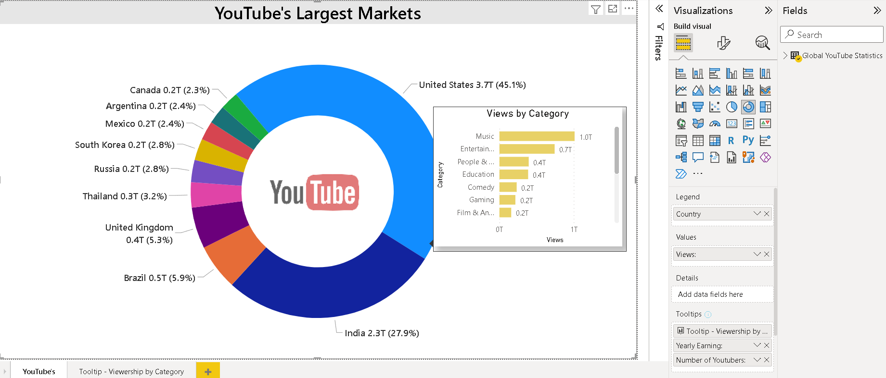
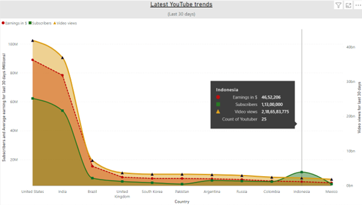

# Power BI Youtube Userbase Dashboard

This Power BI report analyzes Youtube's userbase data and provides key insights.

## 📊 Dashboard Preview
## Visualization 1 - V2:

## Visualization 3:

## 📌 Features
- Userbase trends analysis
- Viewership breakdown by category
- Customer segmentation insights

## 📥 How to Use
1. Download the `.pbix` file.
2. Open it in Power BI Desktop.